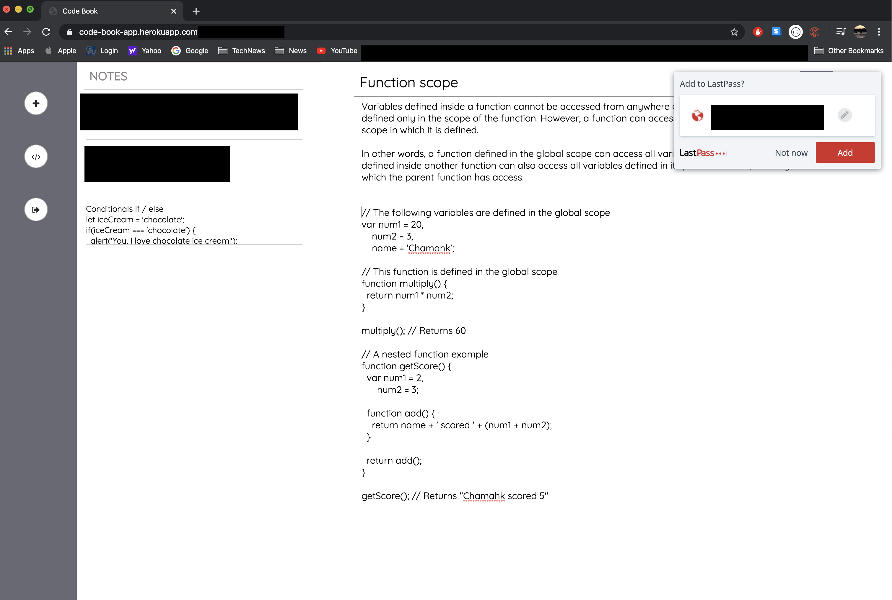

# WELCOME TO CODE BOOK

A note taking app with a built in code editor to help developers stay organized with their notes and code.

## Deployed to Heroku
Check it out here:
[Code Book](https://code-book-app.herokuapp.com/)

## Built with:

* Javascript and jQuery

* Node

* Express Web Server

* Heroku and JAWS Database

* MySQL Database and Sequelize ORM

* Ace.js Library for Code Snippets
 

## Links:

**Collaborators** 
* Will Louis-Charles https://github.com/Spacejnk
* Luis Villalobos https://github.com/luisvlobos
* Daria Korbysheva https://github.com/chuckthefrenchie
* Kristina Calumpong https://github.com/kcalumpong

**Github Repo** https://github.com/chuckthefrenchie/Project_2

